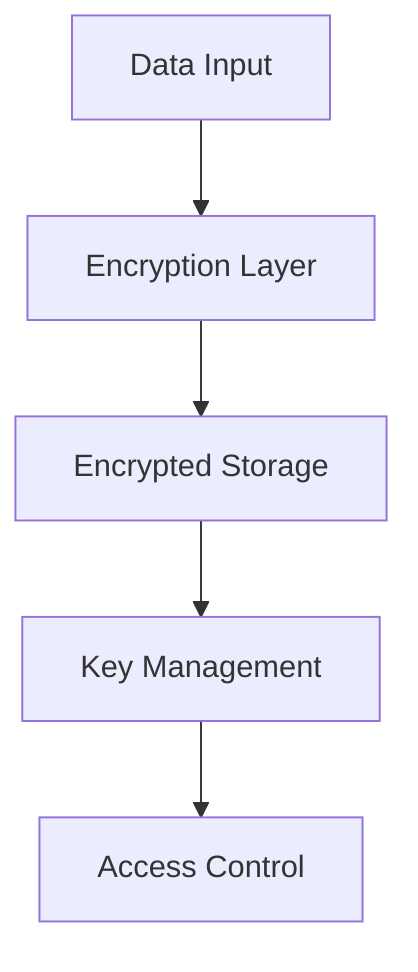

## Security Overview

Pixelated implements multiple layers of security to protect sensitive healthcare data and ensure HIPAA compliance. Our security architecture combines zero-knowledge encryption, quantum-resistant algorithms, and comprehensive audit logging.

## Security Architecture

  <Card
    title="Zero-Knowledge System"
    icon="shield-halved"
    href="/security/encryption"
  >
    End-to-end encryption and zero-knowledge proofs
    Multi-factor authentication and session management
    HIPAA compliance and audit trails
  <Card
    title="Data Protection"
    icon="database"
    href="/security/data-protection"
  >
    Data encryption and secure storage

## Key Security Features

### Zero-Knowledge Implementation


- End-to-end encryption for all data
- Zero-knowledge proof system
- Quantum-resistant algorithms
- Secure key management
- Forward secrecy protocols

### Authentication System


- Multi-factor authentication (MFA)
- WebAuthn support
- Biometric authentication
- Session management
- Brute force protection
- Account lockout policies

### HIPAA Compliance


- Complete audit logging
- Data retention policies
- BAA management
- Compliance reporting
- Violation detection
- Secure backup procedures

### Advanced Cryptography


- Quantum-resistant encryption
- Homomorphic encryption
- Secure multi-party computation
- Zero-knowledge range proofs
- Forward secrecy for chat

## Security Best Practices

  ### Enable MFA Require multi-factor authentication for all accounts ###
  Regular Audits Conduct periodic security audits and assessments ### Access
  Control Implement proper role-based access control (RBAC) ### Monitor Activity
  Set up comprehensive security monitoring and alerts

## Data Protection

### Encryption at Rest



### Encryption in Transit

- TLS 1.3 for all connections
- Perfect forward secrecy
- Strong cipher suites
- Certificate pinning
- HSTS implementation

## Compliance Framework

    - Business Associate Agreements - Privacy Rule compliance - Security Rule
    implementation - Breach notification procedures
    - SOC 2 Type II certified - NIST Cybersecurity Framework - ISO 27001
    compliance - GDPR compliance
    - Regular risk assessments - Incident response plans - Business continuity -
    Disaster recovery

## Security Monitoring

### Real-time Monitoring

```bash Alert Example
{
  "alert_type": "security_event",
  "severity": "high",
  "description": "Multiple failed login attempts detected",
  "source_ip": "xxx.xxx.xxx.xxx",
  "timestamp": "2024-03-21T10:30:00Z"
}
```

```bash Response Action
{
  "action": "account_lockout",
  "duration": "1h",
  "reason": "excessive_login_attempts",
  "account_id": "user_123"
}
```


### Audit Logging

- Comprehensive event logging
- Tamper-evident logs
- Real-time alerting
- Log retention policies
- Automated analysis

## Incident Response

  <Card
    title="Report Security Issue"
    icon="shield-exclamation"
    href="mailto:security@gradiant.dev"
  >
    Contact our security team
    View security documentation

## Additional Resources

- [Security Whitepaper](/security/whitepaper)
- [Compliance Certificates](/security/certificates)
- [Security Advisories](/security/advisories)
- [Best Practices Guide](/security/best-practices)

## Support

For security-related inquiries or to report vulnerabilities:

  <Card
    title="Security Team"
    icon="shield-halved"
    href="mailto:security@gradiant.dev"
  >
    Contact security team
    Submit security findings
